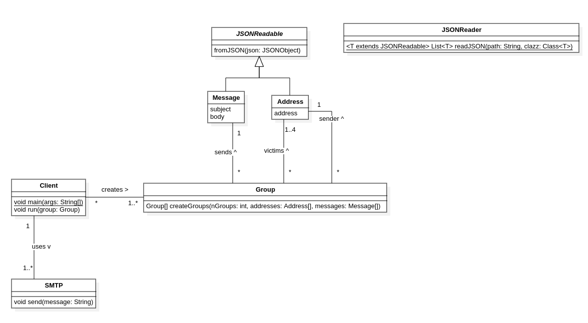

# SMTP Client


## Description of the project

This project allows you to send a manually defined number of emails to a group of people.

The sender and the receivers are randomly chosen from a given file containing adresses.

The content of the message is randomly defined from a file containing a list of messages (object + body).


## Instructions for setting up MailDev (mock SMTP server)

If you want to test email's sending before to do it for real, you can use [MailDev](https://github.com/maildev/maildev). This link bring you to the git repository of the tool. You can find all instructions there.

If you know the process, you can run this command to start the server (Web interface on localhost:1080 and SMTP server on localhost:1025) :

```docker run -d -p 1080:1080 -p 1025:1025 maildev/maildev```

## Configuration instructions

### Building

This tool uses Maven for building and fetching the dependencies. To compile the code, simply run: 

```mvn clean package```

### Data
The messages and addresses must be stored in separate JSON files as follows: 

#### Messages
```json
[
    {
        "subject": "My subject", 
        "body": "My\nbody"
    },
    {
        "subject": "My subject #2", 
        "body": "My\nBody #2"
    }
]
```
#### Addresses

```json
[
    {
        "address": "myaddress@gmail.com"
    },
    {
        "address": "mysecondaddress@gmail.com"
    }
]
```

### Running
To run the program, simply run the following command in your terminal: 

`java -jar target/client_smtp-1.0-SNAPSHOT.jar <nGroups> <path/to/addressFile> <path/to/messagessFile>`

Where nGroups represents the number of groups to form and send emails to.

## Implementation details

### Simplified diagram


### Details
Our implementation uses the SMTP class to format and send SMTP messages. The constructor takes a `BufferedWriter` and `BufferedReader` which enables it to send messages through the method `send`.

The abstract class `JSONReadable` is used by `JSONReader` to read from a file using the `fromJSON` method. (Note that the method is not static, which requires an object to be created with the empty constructor before calling it)

Group has a static `createGroups` method to create groups with randomly chosen victims, sender and message. 

The `Client.run` method takes a `Group` as an argument, and takes care of connecting to the SMTP server, creating an `SMTP` instance and sending the correct sequence of messages (of which an example can be found [here](https://datatracker.ietf.org/doc/html/rfc5321#appendix-D.1)).

This means that one TCP connection is established for each group (and each email since each group sends only 1 email).
